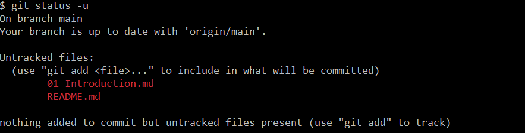

# 개요
## Version Control System (VCS)
- Source Control Management (SCM)이라고도 불린다.
- 소스코드의 히스토리(Version)를 기록

## 버전 컨트롤 원리
- Snapshot
  - Git이 추적(track)하는 파일들의 현재 상태.
  - Git이 추적하는 파일이라는 것은 Git 시스템이 인지하는 파일이라는 뜻이다.
  - 다시 말해, Git의 마지막 Snapshop에 포함되거나 Staging area에 올려진 파일들을 일컫는다.
  - 더 쉽게 말하자면, Commit된 적이 있는 파일이나 현재 Staging area에 add된 파일들을 말한다.
  - 추적되지 않는 파일
  
  - 추적된 파일
  

Git은 프로젝트 데이터를 일련의 스냅샷들의 히스토리로 인식한다. 프로젝트의 특정한 상태에서 파일을 수정하고 커밋을 하면 새로운 스냅샷이 생성된다. 스냅샷은 커밋한 순간 프로젝트 파일들의 상태를 나타낸다.

각각 Snapshot은 실제 스토리지에 저장될 때 그 시점 프로젝트 상태를 통째로 저장하지 않는다. 그렇게 저장한다면 스토리지 공간이 매우 낭비될 것이다. Git은 각 스냅샷을 저장할 때 그 이전 스냅샷과의 변경 사항을 비교하여 <b>변경된 부분만 저장</b>한다.
