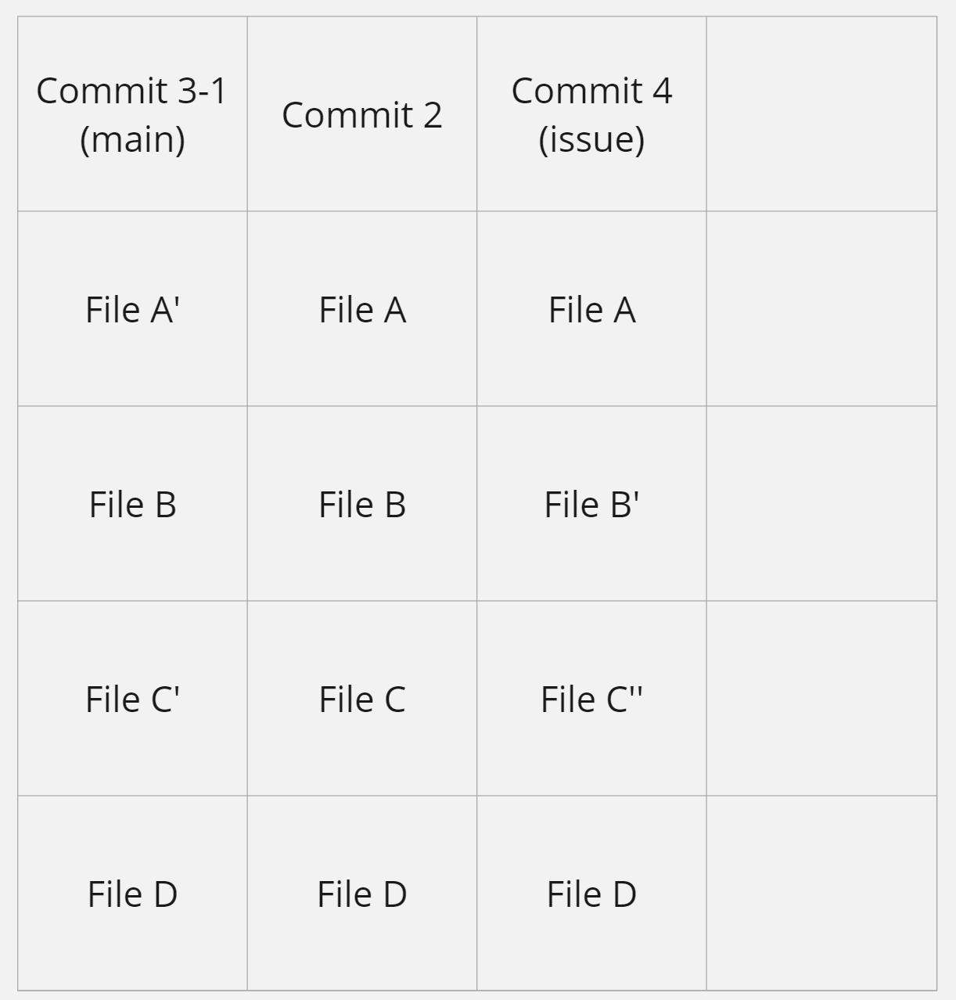
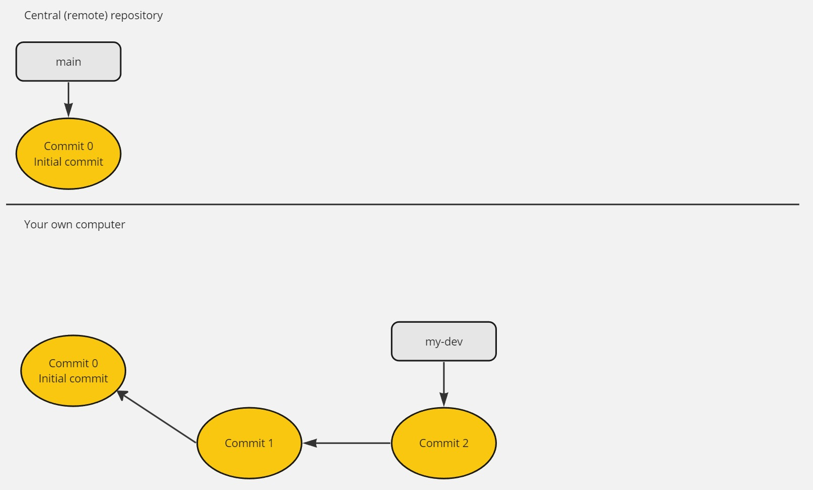
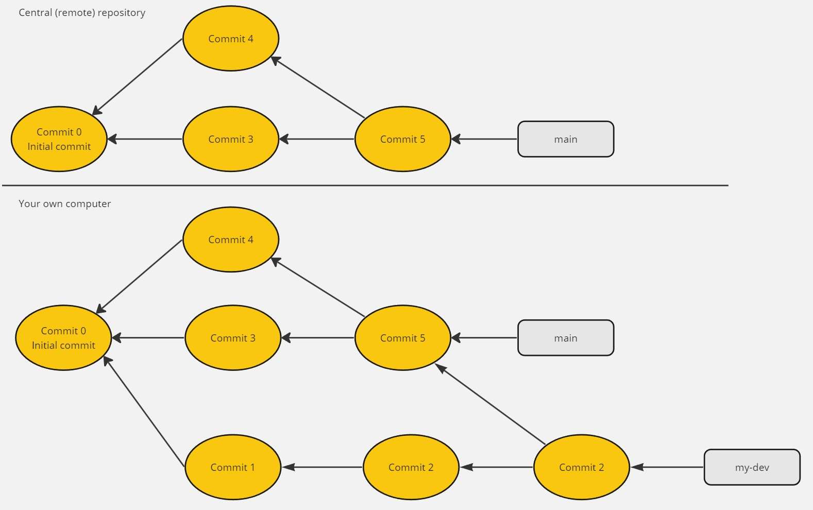

# Merge 전략
<p>Git에서는 브랜치를 여러 개 파서 독립적으로 작업을 하고 나중에 하나의 브랜치에 합치는 방식으로 협업이 이루어진다. 두 브랜치를 하나의 브랜치로 합치는 것을 <b><i>Merge</i></b>라고 한다. Merge는 여러 방식으로 이루어지며 이 각각의 방법을 보통 전략(Strategy)라고 일컫는다.</p>
<p>Merge의 기본적인 원리는 다음과 같다. <b><i>"두 브랜치에서 최신 변경사항을 반영한다."</i></b></p>

## Fast-Forward
현재 레포지토리에 <b>main</b>, <b>issue</b>라는 두 가지 브랜치가 있다고 하자. 레포지토리의 작업 상황이 다음과 같다고 가정한다

각 커밋 사이의 존재하는 간선(화살표)는 그 커밋의 부모가 누구인지 가리킨다.<br>
위 레포지토리에서는 main 브랜치에서 Commit 2까지 작업을 마친 후에 issue 브랜치를 새로 만들어 issue 브랜치 안에서 Commit 3, Commit 4까지 추가 작업을 수행한 상태이다. main 브랜치에서는 더이상 Commit 발생하지 않은 상태이다.
이때 main 브랜치와 issue 브랜치를 다음과 같이 Merge할 수 있다.


두 브랜치를 병합하기 위해서 새로운 Commit을 만들지 않고, 단지 main 브랜치가 Commit 4를 가리키도록 HEAD를 이동시켰다. 이전에 main 브랜치의 상태는 완전하게 issue 브랜치의 부분집합이므로, issue 브랜치의 최신 상태를 main 브랜치에 반영하는 것으로 Merge를 완수할 수 있다.<br>
이와 같은 Merge 방식을 <b>Fast-Forward</b>라고 한다.

## 3-way Merge
<p>3-way Merge는 가장 일반적인 Merge 방식이다.</p>
<p>3-way Merge는 두 브랜치의 상태를 모두 반영하는 Commit을 새로 생성함으로써 Merge가 이루어지는 방식이다.</p>


위 그림의 경우 Fast-Forward로 Merge가 이루어질 수 없는 상태이다. 이 경우 issue 브랜치와 main 브랜치를 병합하기 위해서는 두 브랜치를 병합하는 새로운 Commit을 생성해야 한다.


<p>위 그림에서 main 브랜치가 가리키는 최신 Commit은 main 브랜치와 issue 브랜치의 최신 변경사항을 모두 반영한다.</p>
<p>3-way Merge는 main 브랜치의 최신 Snapshop (Commit 3-1), issue 브랜치의 최신 Snapshop (Commit 4), main 브랜치와 issue 브랜치의 최신 공통 조상의 Snapshop (Commit 2)을 비교하면서 Merge가 발생한 Commit의 상태를 결정한다. 이렇게 세 가지 Snapshop을 비교하면서 Merge가 이루어지기 때문에 3-way Merge라고 불린다.</p>
<p>두 브랜치의 공통 조상인 Commit 2의 Snapshot 상태가 다음과 같다고 가정하자.</p>


<p>Commit 2에 File A, File B, File C, File D, 총 4개의 파일이 존재한다.</p>
<p>여기서 issue 브랜치를 새로 생성하고 각각 main 브랜치, issue 브랜치에서 작업이 발생했다고 하자.</p>


<p>File A는 main 브랜치에서 수정되었고 (File A'), File B는 issue 브랜치에서 수정되었으며 (File B'), File C는 main 브랜치, issue 브랜치 모두에서 수정되었고 (File C, C''), File D는 main 브랜치, issue 브랜치 어디에서도 수정이 일어나지 않았다.</p>
<p>여기서 기억해야 할 것은 두 브랜치를 Merge할 때 Git은 각 파일의 최신 변경사항을 반영한다는 것이다. 다음은 main 브랜치, issue 브랜치를 Merge했을 때 Snapshop을 표에 반영한 것이다.</p>


- File A'가 가장 최신 상태이므로 File A'를 반영한다.
- File B'가 가장 최신 상태이므로 File B'를 반영한다.
- Git은 File C'와 File C'' 중 어떤 것을 반영해야 할지 알지 못한다. 그러므로 <b>Merge Conflict</b>가 발생한다.
- File D에는 어떤 수정도 가해지지 않았으므로 File D가 가장 최신 상태이다. 그러므로 File D를 반영한다.

<p>File C에 대해서 Merge Conflict가 발생했다. 이 경우 사람이 직접 File C가 최신 Snapshot에서 어떤 상태를 가져야 하는지 직접 지정해 주어야 한다. (Conflict가 발생한 파일을 직접 수정하고 다시 Commit하면 된다.)</p>

## Rebase
<p>일반적인 3-way Merge는 안전하지만 히스토리가 복잡해진다는 단점이 있다.</p>


Merge 히스토리의 극단적인 예시<br>
히스토리가 매우 복잡해서 가독성이 엄청 떨어진다.

<p>Rebase는 보통 현재 작업 중인 브랜치에 다른 브랜치의 변경사항을 반영하려고 할 때 사용된다. 현재 작업 중인 브랜치는 그 브랜치에서 작업하는 개발자의 영역으로, 다른 브랜치에서 발생한 Merge 히스토리를 반영하고 싶지 않을 것이다. 한편, 다른 브랜치의 변경사항을 작업 중인 브랜치에 반영해야 할 일이 발생할 수 있다. 이런 경우, 작업 중인 브랜치의 히스토리를 건드리지 않으면서 다른 브랜치의 변경사항을 반영할 때 Rebasing을 수행할 수 있다.</p>

### Rebase 과정
<p>현재 레포지토리의 작업 상황이 다음과 같다고 가정한다.</p>


main 브랜치에 issue 브랜치의 상태를 반영하고자 한다. 다음과 같은 커맨드를 입력함으로써 rebasing을 수행할 수 있다.
```
git checkout main
git rebase issue
```


<p>그러면 issue의 변경사항을 반영한 새로운 Snapshot인 <b>Commit 3'</b>이 생성된다. Commit 3'의 상태는 main 브랜치와 issue 브랜치를 <b>일반적인 3-way Merge를 수행했을 때와 동일하다.</b> 이때 git log 커맨드를 입력해 히스토리를 살펴보면 다음과 같다.</p>
<i><p>Commit 2 => Commit 4 => Commit 5 => Commit 3</p></i>
<p>main 브랜치의 히스토리를 훼손하지 않은 채 issue 브랜치의 변경사항이 main 브랜치에 반영된 모습을 볼 수 있다. 그러면서 커밋 히스토리는 선형(linear) 그래프로 깔끔하게 나타난다.</p>
<p>이후 issue 브랜치에서 main 브랜치를 Merge하면 다음과 같이 Fast-Forward가 발생한다.</p>


### Rebase의 위험성
<p>Commit 3과 Commit 3'는 같은 Commit처럼 보이지만 엄연히 다른 Commit이다. 이 점을 간과하면 rebasing은 독이 될 것이다.</p>
<p>다음 예시를 보자</p>


Initial Commit 상태에서 프로젝트가 시작한다.



내 컴퓨터에 Remote repository를 clone해서 Local repository를 만들고 my-dev 브랜치를 파서 작업을 수행했다. 그리고 Commit 1, Commit 2를 Commit했다.


동료들이 Commit한 결과가 Remote repository에 반영했다. Commit 5는 Commit 2, Commit 3을 Merge한 Commit이다.



나는 ```git pull``` 커맨드를 이용해 Remote repository의 Commit을 Local repository로 Fetch하고 Merge했다.


동료가 Commit 3으로 돌아가 (Revert) Commit 3과 Commit 4를 일반적인 3-way Merge 대신 Rebasing으로 합치려 했다. 그 결과 Commit 3'이 만들어졌다. 그리고 ```git push origin main --force``` 커맨드로 이전 Commit 기록을 덮어쓰면서 Remote repository에 반영했다.


나는 이 변경사항을 Local repository에 Pull했다. 그런데 Rebasing으로 인해 사라져야 할 Commit 3, Commit 4는 이미 나의 Local repository에 남아 있다. Commit 3과 Commit 3'은 엄연히 다른 Commit이기 때문에 나는 새로운 Merge Commit (Commit 7)을 만들면서 Remote repository의 변경사항을 반영해야 했다. 동료의 트롤링 덕분에 커밋 히스토리가 매우 복잡해졌다.

### 결론
이렇듯 Rebasing은 위험성을 내포하고 있기 때문에 Commit Convention 아래 올바르게 사용되어야 한다.