# Pull Request

Git을 이용한 협업을 할 때, 브랜치를 파서 작업을 진행한 후 Pull Request를 생성해 팀원들의 코드 리뷰와 검증을 받고 develop 브랜치에 Merge를 진행한다.

## Pull Request 과정
### 1: 새로운 branch를 생성해서 작업을 진행한다.
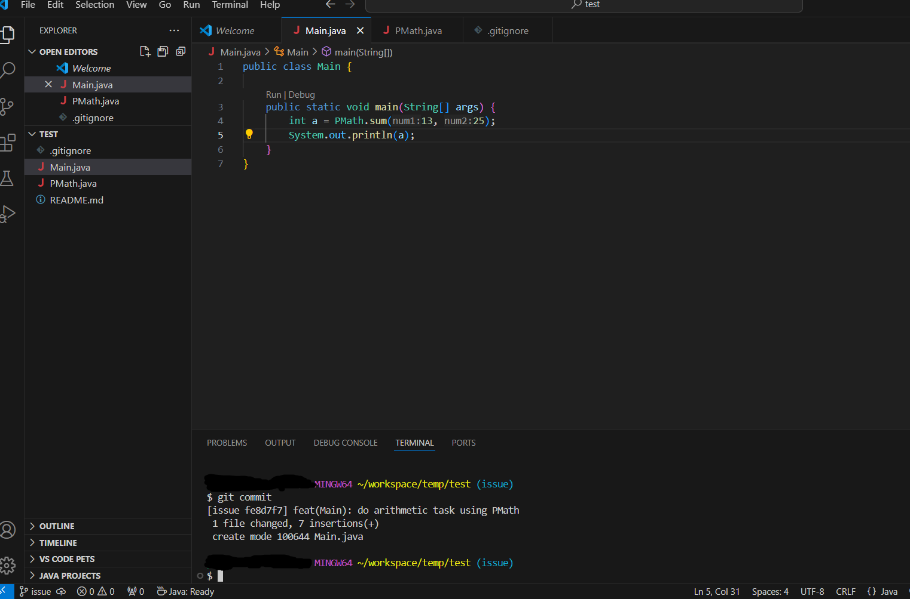
issue라는 브랜치를 파서 작업을 진행한다.

### 2: Remote repository에 작업을 진행한 branch를 반영한다.
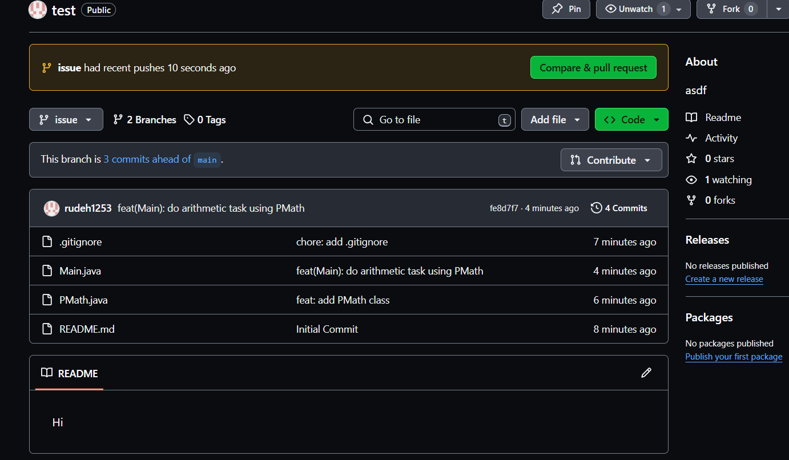

### 3: Pull Request를 생성하는 곳까지 들어간다.
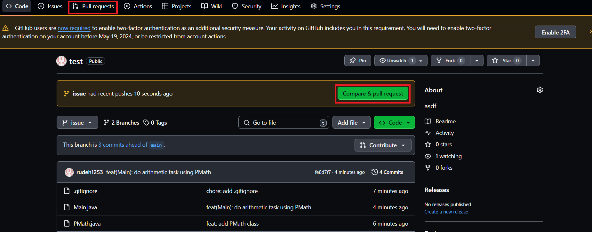
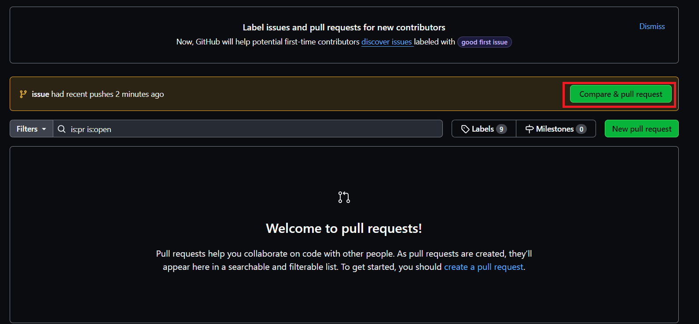

### 4: Pull Request 메시지를 작성한다.
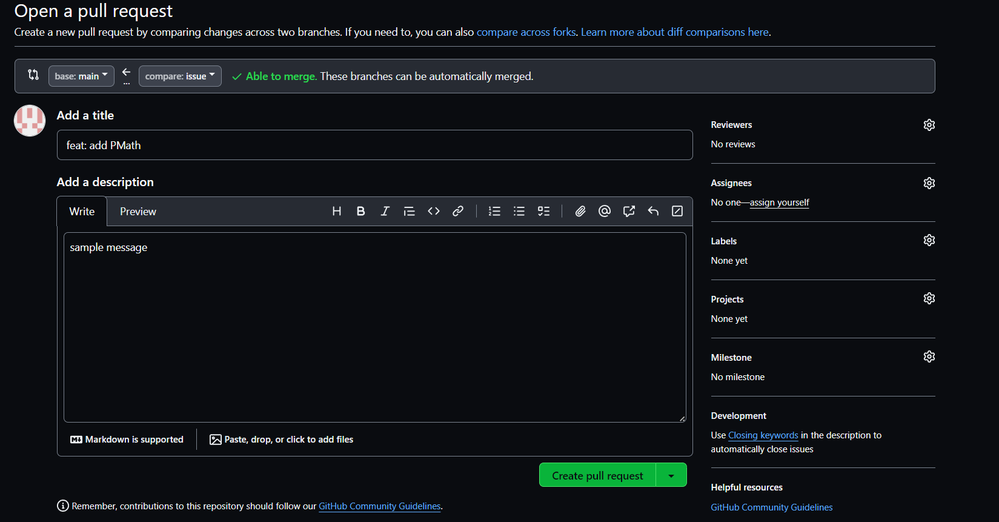

스크롤을 내려보면 Commit 목록을 확인할 수 있다.
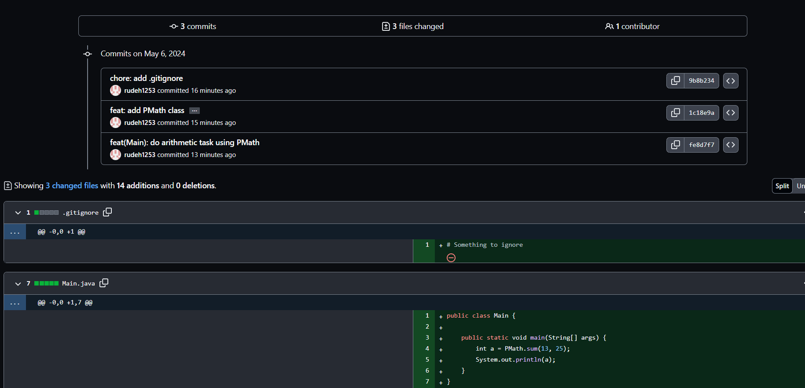

### 5: Reviewers를 등록한다.

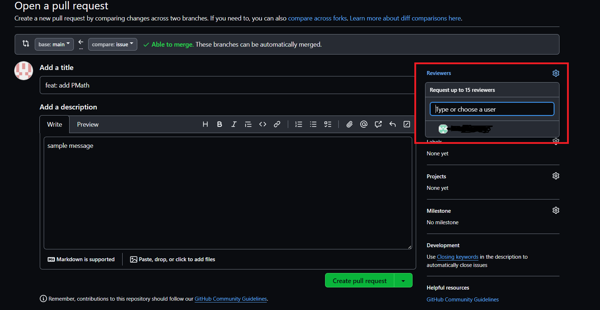

### 6: Pull Request를 생성한다.
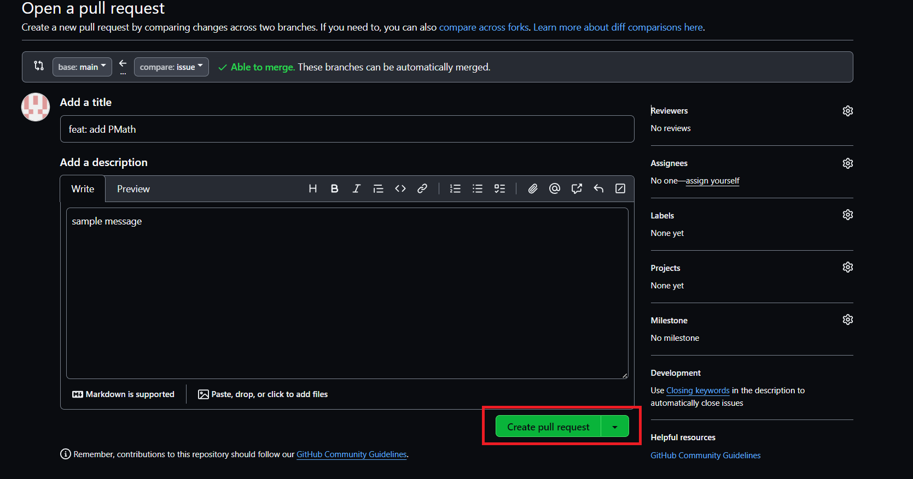

### 7: Reviewer는 Pull Request에서 코드 리뷰를 수행할 수 있다.
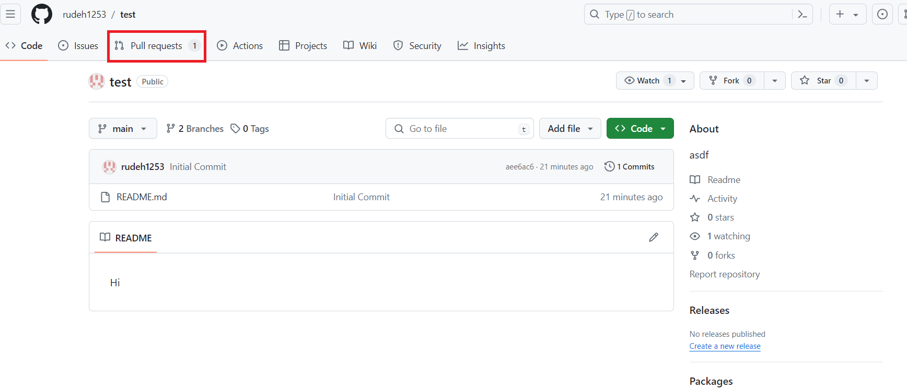
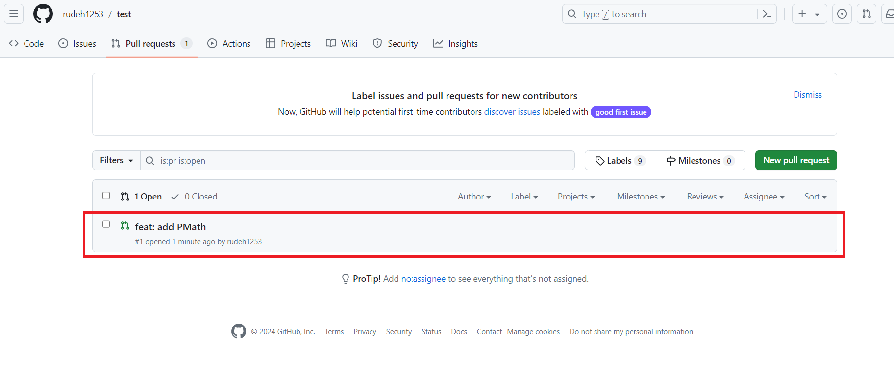
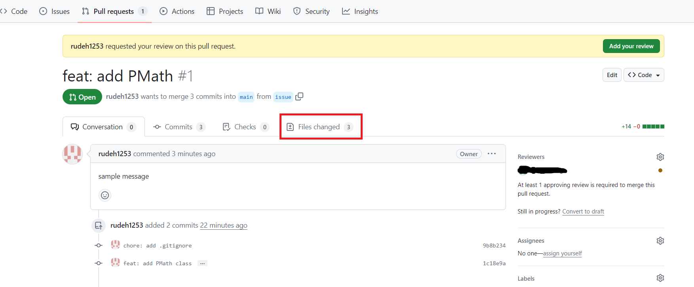
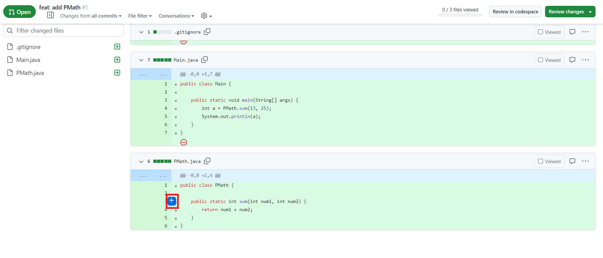
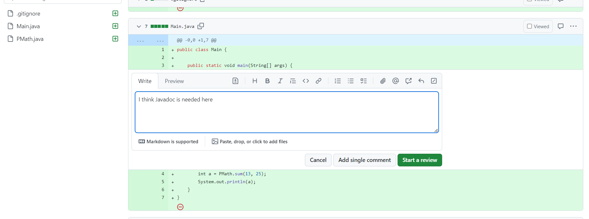
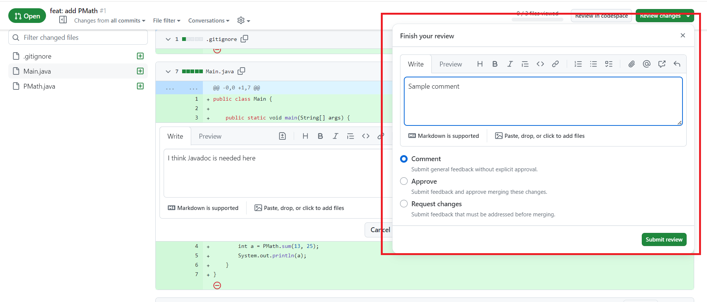

### 8: Reviewer는 Pull Request를 승인(Approve)할 수 있다.
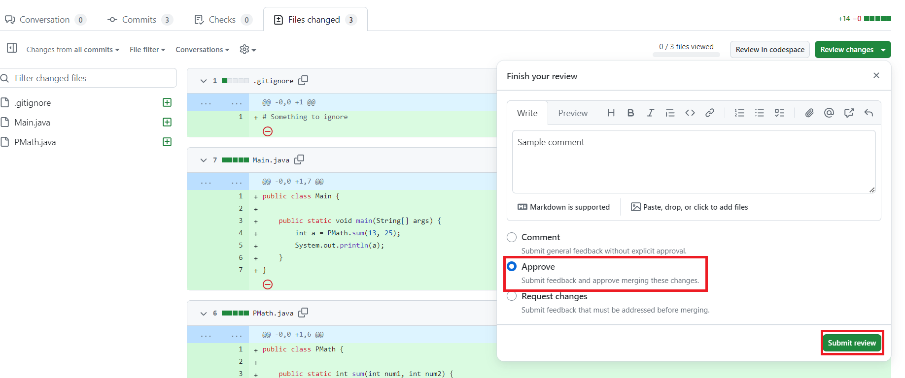

모든 Reviewer가 Pull Request를 승인해야 Merge가 이루어질 수 있도록 설정하는 것이 Good Practice이다.

- Comment: 단순 코드 리뷰
- Approve: Pull Request 승인
- Request changes: 코드를 다시 작성하도록 요청

### 9: 모든 Review가 Pull Request를 승인하면 Branch를 Merge할 수 있다.
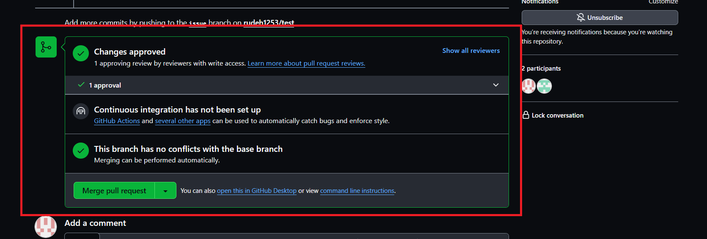

Merge하면 Pull Request 상태가 다음과 같이 바뀐다.
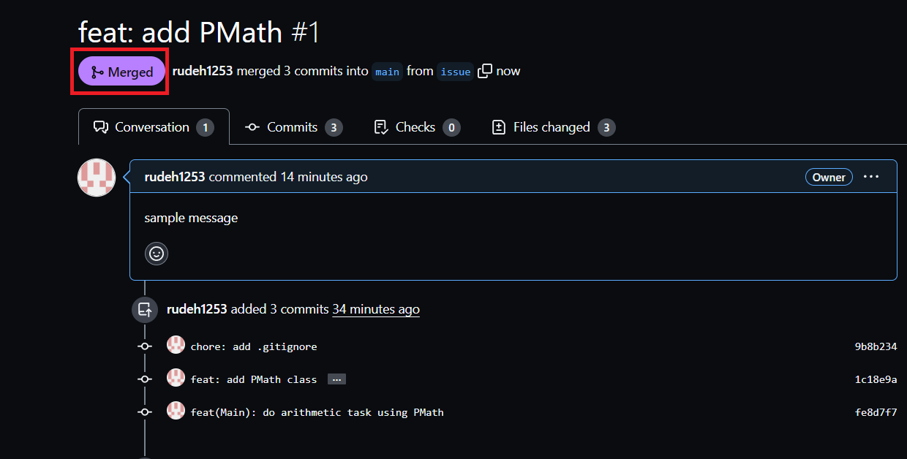

이 Pull Request는 이제 닫힌 (Closed) 상태이며 이 Pull Request에 대한 작업은 끝이 난다.

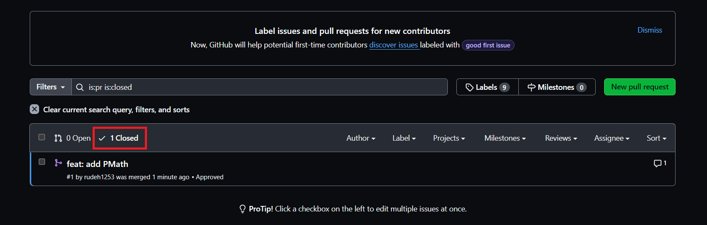
Pull Request가 닫힌 모습

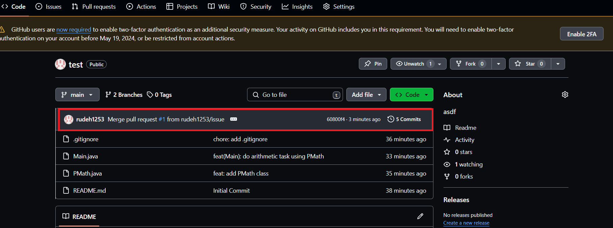
Pull Request가 main 브랜치에 반영된 모습

일반적으로 Pull Request가 완료되면 해당 브랜치는 삭제한다.
