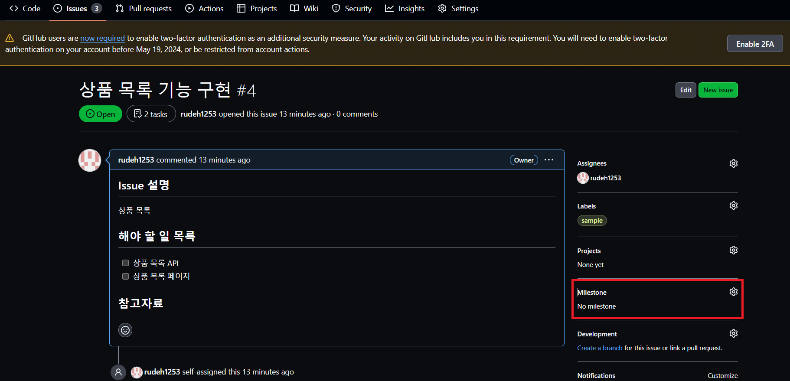

# GitHub Issue

GitHub Issue는 프로젝트를 진행하는 과정에서 발생하는 issue를 관리하는 GitHub의 툴이다.

- <b>Issue</b>: 소프트웨어 개발 과정에서 발생하는 새로운 기능 추가에 대한 요구, 개선 사항에 대한 요구, 버그 제보 등을 의미한다.

## 새로운 Issue 만들기

## Issue 템플릿 만들기

새로운 Issue를 만들 때마다 적용될 템플릿을 만들 수 있다.

Repository의 Settings에 들어간다.

General 탭에서 Features 항목으로 내려간다. Issues 항목의 Set up templates를 클릭한다.

세 가지 템플릿을 선택할 수 있다. 여기서는 Custom Template을 생성하겠다.

Template 수정 버튼을 클릭한다.

템플릿을 작성한다.

Commit한다. 여기까지 마치면 Template이 만들어진다.

Issue를 만들 때 Template을 선택할 수 있다. Get started 버튼을 클릭함으로써 해당 Template을 적용할 수 있다.

## Issue 본문에 해야 할 일 목록 추가
다음과 같은 마크다운 문법을 사용함으로써 해야 할 일 목록을 추가할 수 있다.

이를 미리보기로 보면 다음과 같이 나타난다.

Issue 작성 후, 버튼을 클릭함으로써 목록을 체크할 수 있다.

## Issue 담당자 배정

하나의 Issue에 Issue를 발행한 자기자신을 포함해, 복수의 담당자를 배정할 수 있다. 담당자를 배정함으로써 해당 Issue에 참가하는 사람들을 명확히 할 수 있다.

### Issue에 Pull Request 연결하기

Issue에 Pull Request 혹은 branch를 연결하면 해당 issue가 진행 중이라는 것을 표시할 수 있고, 연결된 Pull Request 혹은 branch가 Merge되면 자동으로 해당 issue가 닫히도록 설정할 수 있다.

예제를 위해 issue라는 브랜치를 생성했고, Commit 1회 진행했다. 그리고 issue 브랜치를 main 브랜치로 Merge하는 Pull Request를 생성했다.

#### 1: Issue에 들어가 Development의 톱니바퀴 버튼을 클릭한다.

#### 2: issue 브랜치를 찾아 추가한다.

다음과 같이 issue 브랜치가 추가된 것을 확인할 수 있다.

#### 3: issue 브랜치에 대한 Pull Request로 들어가 Merge를 진행한다.

Merge를 진행하면 다음과 같이 해당 issue가 close된 것을 확인할 수 있다. 이러면 해당 issue는 모두 해결된 것이다.

## Label

GitHub의 각 issue에 label을 달아서 issue들을 분류할 수 있다. label은 issue뿐만 아니라 Pull Request, discussion에도 배정할 수 있다.

GitHub에서는 기본적인 label을 9가지 제공한다.

GitHub 공식 문서에서는 기본 제공되는 label을 다음과 같이 설명한다.

- bug

Indicates an unexpected problem or unintended behavior
- documentation

Indicates a need for improvements or additions to documentation
- duplicate

Indicates similar issues, pull requests, or discussions
- enhancement

Indicates new feature requests
- good first issue

Indicates a good issue for first-time contributors
- help wanted

Indicates that a maintainer wants help on an issue or pull request
- invalid

Indicates that an issue, pull request, or discussion is no longer relevant
- question

Indicates that an issue, pull request, or discussion needs more information
- wontfix

Indicates that work won't continue on an issue, pull request, or discussion

### Custom Label 만들기
해당 Repository에서 사용할 수 있는 Label을 직접 만들 수 있다.

우선 Issues, 혹은 Pull Request 페이지에 들어간다.

그 다음 Labels 버튼을 클릭한다.

다음과 같이 GitHub에서 기본으로 제공하는 Label들이 보인다. 여기서 새로운 Label을 만들기 위해 New label 버튼을 클릭한다.

적당히 Label 이름과 설명을 작성하고 Label 색상을 지정한다. 그리고 Label을 생성한다.

Label 생성이 완료되면 다음과 같이 생성된 Label을 확인할 수 있다.

### Issue에 Label 배정하기

예제를 위해 임의의 Issue를 새로 생성했다.

Issue 페이지 우측의 Labels에서 Label을 추가할 수 있다.

다음과 같이 Issue에 sample이라는 Label을 추가했다.

Issues 페이지에서 특정 Label을 가진 issue만 볼 수 있도록 필터링할 수 있다.

## Milestone

GitHub Milestone 기능을 활용해서 하나의 그룹으로 묶인 issue와 pull request들의 진행 상황을 추적할 수 있다.

### Milestone 생성하기

Milestone은 Repository의 Issues 페이지 혹은 Pull Requests 페이지에서 생성할 수 있다.

Issues 페이지 혹은 Pull Requests 페이지에서 Milestone 버튼을 클릭한다.

New milestone 버튼을 클릭한다.

Milestone 제목, 만기일 (due date), Milestone 설명을 작성한다.

생성된 Milestone을 확인할 수 있다.

### Milestone 할당하기

Milestone은 개별 Issue 페이지에서 할당할 수도 있고 Issues 페이지에서 여러 issue를 한번에 할당할 수 있다.

Milestone을 할당할 issue로 들어간다. 그리고 Milestone의 톱니바퀴 버튼을 클릭한다.

아까 생성한 Sample milestone을 할당한다.

Milestone이 할당된 모습을 확인할 수 있다.

이번에는 상단 네이게이션바에서 Issues 페이지로 들어간다.

Milestone을 할당할 issue들을 체크하고 오른쪽 위에 Milestone 드롭다운 버튼을 클릭한다.

할당할 Milestone을 선택한다.

각 issue들에 Milestone이 할당된 모습을 확인할 수 있다.

Issue 하나를 선택해 Close issue를 수행해 보자.

Issue가 닫혔다는 것은 해당 issue가 해결되었다는 것을 의미한다. 즉, 프로젝트 작업이 진행되었다는 것을 뜻한다. Issue를 닫으면 다음과 같이 Milestone의 진행 상황이 변경된 것을 확인할 수 있다.

Milestone의 세부 사항을 확인하는 페이지에 Sample milestone의 상태가 나타난다. 이곳에서 다음의 사항을 확인할 수 있다.
- Milestone에 대한 설명
- Milestone의 만기일
- Milestone의 진행 상황에 대한 퍼센티지
- 해당 Milestone과 연관된 issue와 pull request의 open, closed 현황
- 해당 Milestone과 연관된 issue와 pull request 목록을 확인할 수 있다.

## Reference
- [GitHub 공식 문서](https://docs.github.com/en/issues/tracking-your-work-with-issues/about-issues)