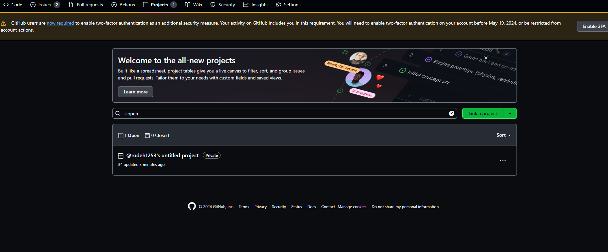
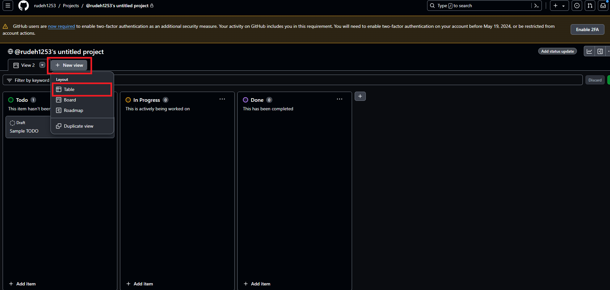
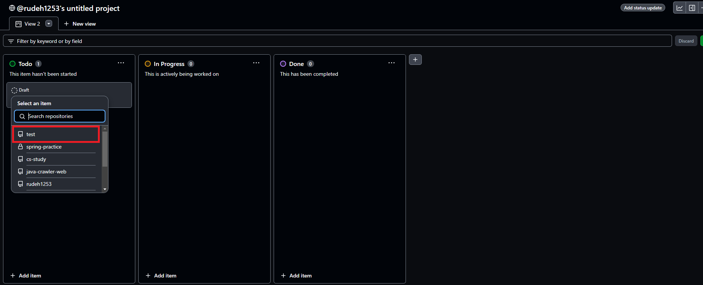

# GitHub Projects

GitHub Projects는 GitHub에서 제공하는 프로젝트 관리 툴이다. GitHub Projects를 활용함으로써 현재 프로젝트의 진행 상황, 작업 item들을 시각적으로 확인하고 관리할 수 있으며, GitHub Issue와 연동할 수 있다.

## GitHub Projects의 특징
- 프로젝트 관리의 편의성
  - 작업 item을 Trello처럼 카드 형태로 Board에 추가하고 관리할 수 있다.
  - 작업의 우선순위를 조정하고 상태를 업데이트함으로써 팀원들이 프로젝트 상태를 실시간으로 확인할 수 있다.
- 협업
  - 작업 item과 관련된 Pull Request, Issue 등을 카드와 연결하여 프로젝트의 전반적인 진행 상황을 공유할 수 있다.
- 워크플로우
  - Workflow 기능을 사용해 자동으로 작업을 처리하고 필요한 작업을 설정할 수 있다.
- 커스터마이징

## GitHub Project 생성

<p>화면 오른쪽 위 내 아이콘을 클릭해 Projects 페이지로 들어간다.</p>


<p>New Project를 클릭한다. 여기서는 Board를 생성한다.</p>


<p>다음과 같이 생성된 모습을 확인할 수 있다.</p>


## GitHub Project와 Repository 연동

<p>Repository와 Project를 연동하는 것은 어렵지 않다.</p>
<p>우선 Repository 페이지에 들어간다. 그 다음 상단 내비게이션 바에서 Projects를 선택한다.</p>


<p>그 다음 Link a project 버튼을 누르고 연동할 Project를 선택한다.</p>


<p>연동된 모습이 다음과 같이 나타난다.</p>



## Project View

Project view는 생성된 project를 여러 관점에서 조망할 수 있게 하는 기능이다. 예를 들어,

- 아직 시작되지 않는 모든 item들을 보여주는 view (filter on "Status")
- 각 팀의 workload를 보여주는 view (group by a custom "Team" field)
- 목표 출하일에 가까운 item들을 보여주는 view (sort by a date field)

### 새로운 View 추가하기

<p>우선 새로 view를 추가할 project에 들어간다.</p>


<p>New View 드롭다운 버튼을 클릭하면 메뉴가 나타난다. 여기서 Table을 선택한다.</p>



<p>Table view가 추가된 것을 확인할 수 있다.</p>


## GitHub Projects Best Practice

### Issue를 더 작은 issue로 쪼개라
더 작고 많은 issue는 작업이 더 수월하게 관리될 수 있고 팀원들이 병렬적으로 작업할 수 있게 한다. 또한 작은 issue에 대해 작은 pull request를 발생시킬 수 있는데, 작은 pull request에 대해서 행하는 코드 리뷰가 더 쉽다.
작은 issue를 큰 Goal에 포함시키기 위해 task list, milestone, label을 활용한다.

### 소통하라
Issue와 pull request 소통을 원활하게 한다. Comment를 남길 때 ```@mentions```를 활용하여 개별 팀원 혹은 팀 전체가 알 수 있도록 하라. 또한 issue를 팀원에게 배정(assignment)하여 책임하에 소통할 수 있도록 하라.

### Project에 대한 정보를 공유하기 위해 설명 (Description), README, 그리고 status update를 활용하라

- Project의 목적 설명
- Project view 및 사용법에 대한 설명

### View를 사용하라
Project를 다양한 관점에서 바라볼 수 있도록 project view를 활용하라

### 자동화하라.
업무를 자동화함으로써 작업에 소요되는 시간을 줄이고 프로젝트 그 자체에 더 많은 시간을 투자할 수 있다. <br>
Project는 내장 workflow를 제공한다. 예를 들어, 하나의 issue가 닫히면 자동으로 status가 "Done" 상태가 되도록 세팅할 수 있다. 또한 내장 workflow를 item이 특정한 기준을 충족하면 아카이빙되도록 하거나 repository에서 자동으로 item이 추가되도록 커스터마이징할 수 있다.<br>
추가적으로, GitHub Actions와 GraphQL API는 project 관리 업무 루틴을 자동화할 수 있게 해 준다. 예를 들어, 리뷰를 기다리는 pull request에 대해 project에 pull request를 추가하고 status를 "needs review"로 세팅하는 workflow를 생성할 수 있다. 이 작업은 pull request가 "ready for review" 상태로 마킹되면 자동으로 실행된다.

## Item 추가

<p>Projects 페이지에서 Add Item 버튼을 클릭한다.</p>


<p>Item 내용을 작성하고 Enter를 누른다.</p>


<p>Item이 추가된다.</p>


### Pull request를 Project item으로 추가

<p>Pull request나 issue를 item으로 추가하는 데 여러 옵션이 있다.</p>

- 개별적으로
- 자동으로
- 한 번에

<p>Issue 혹은 pull request를 project에 추가하면 issue 혹은 pull request 타임라인에 이벤트가 추가된다. 타임라인 이벤트는 issue 또는 pull request가 삭제되거나 해당 issue, pull request project item의 status 필드가 변경될 경우에도 추가된다.</p>

### Issue, pull request URL 붙여넣기

<p>Add Item을 클릭한다.</p>


<p>Issue의 URL을 붙여넣고 Enter를 누른다.</p>


<p>새로운 item이 추가된다.</p>


<p>Item을 클릭하면 해당 Issue가 보여진다.</p>


### Repository에서 한 번에 여러 issue나 pull request 가져오기

<p>Add Item을 클릭한다.</p>


<p>+ 버튼을 클릭하고 Add item from repositoyr를 선택한다.</p>


<p>가져올 수 있는 issue나 pull request 목록이 보인다. 여기서 가져올 항목을 체크하고 추가 버튼을 누른다.</p>


<p>Item이 추가된 모습을 확인할 수 있다.</p>


### Item을 issue로 만들기

<p>Convert to Issue를 선택한다.</p>


<p>Issue를 추가할 repository를 선택한다.</p>



<p>Issue로 변환된 모습을 확인할 수 있다.</p>


## Reference
- [GitHub 공식 문서](https://docs.github.com/en/issues/planning-and-tracking-with-projects/learning-about-projects/about-projects)