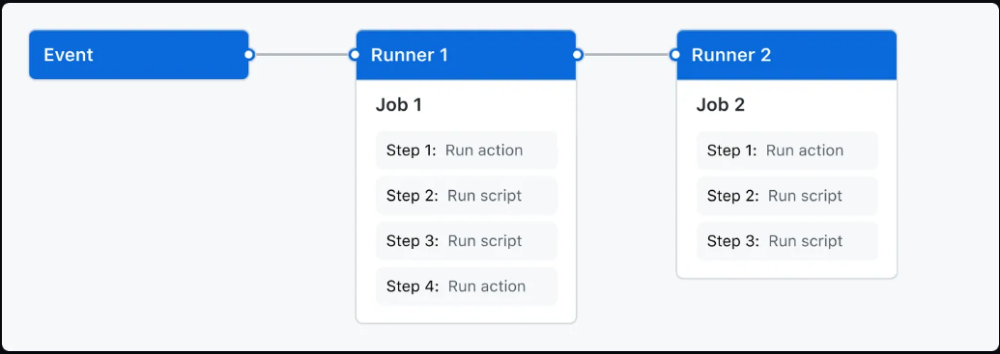

# GitHub Actions

GitHub Actions는 빌드, 테스트, 배포 파이프라인을 자동화하는 CI/CD 플랫폼이다. *Workflow*는 repository의 모든 pull request에 대해서 빌드와 테스트를 수행하고 merge된 pull request를 배포하는 기능을 한다.<br>
GitHub는 workflow를 실행할 수 있는 Linux, Windows, macOS 가상 머신을 제공하거나 유저가 소유한 데이터 센터 또는 클라우드 인프라에 실행 프로그램을 호스팅할 수 있다.

## GitHub Actions 컴포넌트

Pull request나 issue가 생성되는 등 repository에 이벤트가 발생하면 workflow가 실행되도록 GitHub Actions를 구성할 수 있다. Workflow는 순차적, 혹은 병렬적으로 실행될 수 있는 하나 또는 여러 개의 *job*을 포함한다. 각각의 job은 가상 머신이나 컨테이너에서 실행된다. 하나의 작업은 하나 또는 여러 개의 step을 포함한다. 하나의 step은 스크립트를 실행하거나 재사용 가능한 extension인 *action*을 실행한다.



## Workflow

Workflow는 임의로 구성할 수 있는 자동화된 프로세스이다. 하나의 workflow는 하나 또는 여러 개의 job을 실행한다. Workflow는 YAML 파일로 정의된다.<br>
Workflow는 다음 상황에서 실행된다.

- 이벤트가 발생했을 때
- 수동으로
- 스케줄에 의해

Workflow는 repository의 ```.github/workflows``` 디렉토리에 정의되며, 하나의 repository는 여러 개의 workflow를 가질 수 있다. 하나의 repository에 속한 각각의 workflow는 각자 다른 작업을 수행한다. 예를 들어, pull request를 빌드하고 테스트하는 workflow가 있고, 애플리케이션을 배포하는 workflow가 있고, 팀 구성원이 issue를 발행할 때마다 label을 추가하는 작업을 담당하는 workflow가 있을 수 있다.

## Event

이벤트는 workflow가 실행되도록 하는 repository 내의 특정한 activity이다. 예를 들어, activity는 누군가가 pull request를 생성하거나, issue를 발행하거나, commit을 push할 때 GitHub으로부터 만들어진다.

## Jobs

Job은 step들의 집합으로, 각각의 step은 쉘 스크립트 또는 *action*을 포함한다. Step은 순서대로 실행되며 각각의 step은 서로 의존적이다.

## Actions

Action은 GitHub Actions 플랫폼에서 제공하는 커스텀 애플리케이션이다. Action은 자주 반복되는 복잡한 작업을 수행한다.