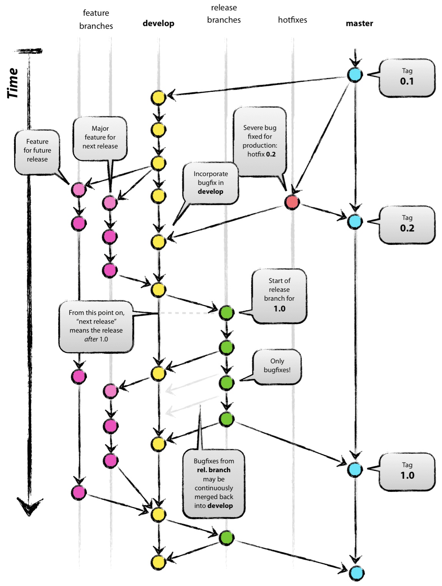
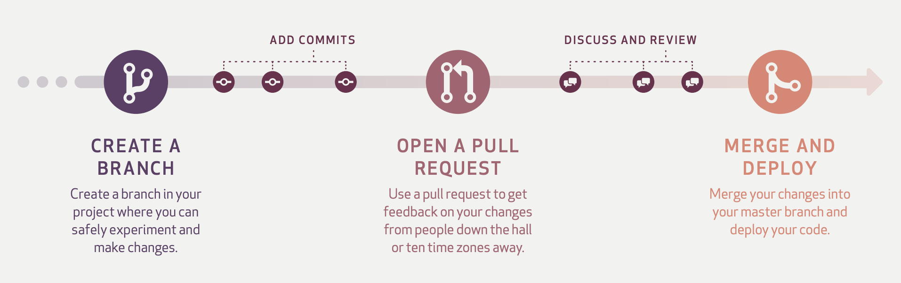

# Gitflow

Gitflow는 Git을 관리하기 위한 브랜치 전략 (혹은 브랜치 모델) 중 하나이다.<br>
브랜치는 통일된 Convention 아래 일관적으로 생성되어야 한다. 각 브랜치는 목적을 가져야 하고 어떤 브랜치에 merge되어야 하는지 등을 Convention으로 정해야 한다.<br>
Git 브랜치 전략은 Git 브랜치를 효과적으로 관리하기 위한 워크플로우이다. 프로젝트 팀원들이 그 프로젝트에 사용할 브랜치 전략을 직접 정의해도 좋다. 그러나 이미 브랜치를 효과적으로 관리하기 위한 **모범 사례**가 존재한다. 그중 Gitflow가 유명하다.

## What is Gitflow



Gitflow는 크게 main, develop, supporting 브랜치로 구분하여 브랜치를 관리한다. supporting 브랜치는 또다시 feature, release, hotfix 브랜치로 나뉜다. main, develop 브랜치는 개발 프로세스 전반에 걸쳐 항상 유지되는 브랜치이며, supporting 브랜치는 필요할 때마다 생성되고 역할을 다하면 삭제된다.

### main 브랜치

출시 가능한 **프로덕션 코드**를 유지하는 브랜치다. 배포된 각 버전을 Tag를 이용해 표시해 둔다.

### develop 브랜치

다음 버전 개발을 위한 코드를 유지하는 브랜치다. 개발이 완료되면 main 브랜치로 merge된다.

### feature 브랜치

하나의 기능을 개발하기 위한 브랜치다. develop 브랜치에서 생성하며, 기능이 개발 완료되면 다시 develop 브랜치로 merge된다. 머지할 때 주의할 점은 fast-forward로 merge하지 않고 merge commit을 생성하며 merge를 해 주어야 한다. 이런 방식을 사용하면 히스토리가 특정 기능 단위로 묶인다.<br>

네이밍은 ```feature/branch-name```과 같이 지정한다.

### release 브랜치

소프트웨어 배포를 준비하기 위한 브랜치다. develop 브랜치에서 생성하며, 버전 이름 등의 데이터를 수정하거나 배포 전 사소한 버그를 수정하기 위해 사용된다. 배포 준비가 완료되었다면 main과 develop 브랜치에 merge한다. 이때 main 브랜치에는 Tag를 사용해서 버전을 표시한다.

네이밍은 ```release/v1.1```과 같이 지정한다.

### howfix 브랜치

이미 배포된 버전에 문제가 발생했다면 hotfix 브랜치를 사용해 문제를 해결한다. main 브랜치에서 생성하며, 문제 해결이 완료되면 main과 develop 브랜치에 merge한다.

네이밍은 ```hotfix/v1.0.1```과 같이 지정한다.

### Gitflow는 웹 애플리케이션에 적합하지 않다.

Gitflow는 명시적으로 버전 관리가 필요한 애플리케이션 개발에 유리하다. 그러나 웹 애플리케이션은 하나의 최신 버전만을 제공한다. 또한 하루에도 몇 번이나 릴리즈될 수 있다. 이러한 특성 때문에 웹 애플리케이션 개발에 Gitflow는 적합하지 않다.<br>
소프트웨어를 지속적으로 제공한다면 Gitflow 대신 Github Flow와 같은 더 단순한 워크플로우가 적합할 수 있다.

## Github Flow



Github Flow는 Gitflow보다 더 단순한 구조를 가진다.

### main 브랜치

항상 **stable**한 상태여야 한다. Stable하다는 것은 모든 커밋은 언제 배포하든 문제가 없어야 하고, 언제든 브랜치를 새로 만들어도 문제가 없어야 한다는 것을 의미한다. main 브랜치의 모든 커밋은 문제 없이 빌드가 진행되어야 하고 테스트를 통과해야 한다. 이 점이 Github Flow가 강제하는 유일한 사항이다.

### topic 브랜치

새로운 기능을 개발할 때 사용되는 브랜치다. main 브랜치에서 생성한다. Gitflow의 feature 브랜치와 거의 유사한 역할을 한다.<br>

topic 브랜치 네이밍은 명확한 이름으로 선정한다. ```user-content-cache-key```, ```submodules-init-task```, ```redis2-transition``` 등이 있다.<br>

topic 브랜치의 커밋을 기능이 완성되지 않았더라도 꾸준히 push를 진행한다. 이를 통해 구성원 간에 지속적인 커뮤니케이션을 가능케 한다.<br>

Github Flow에서는 기능을 개발하는 와중에도 언제든 상관없이 PR을 개설한다. 코드의 변경이 없더라도, 스크린샷, 아이디어를 공유하고 싶을 때에도 PR을 개설한다. 개발자는 개설된 PR에서 토론을 하고, 코드 리뷰를 진행한다.<br>

토론과 리뷰가 끝났으면 approve를 받고 main 브랜치에 topic 브랜치를 merge한다. 이때 topic 브랜치는 CI 빌드를 통과해야 merge할 수 있다.

### 기타

Github Flow에서는 별도의 hotfix 브랜치를 생성하지 않는다. 버그 수정은 topic 브랜치에서 진행한다.

### 개발팀이 소규모 애자일 팀이고, 제품이 단일 릴리즈 버전밖에 존재하지 않는다면 Github Flow가 적절하다.
대부분의 웹 애플리케이션은 여러 버전을 관리하지 않고, 가장 최신 버전 하나만을 사용자가 사용하게 된다. Github Flow는 하루에 변경사항을 작은 단위로 신속하고 자주 병합/배포할 수 있는 구조로, CI/CD에 적합한 브랜치 전략이라 볼 수 있다.

## References
- [Git 브랜치 전략](https://hudi.blog/git-branch-strategy/)
- [A successful Git branching model](https://nvie.com/posts/a-successful-git-branching-model/)