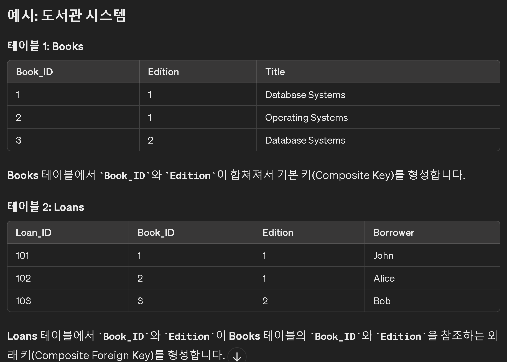
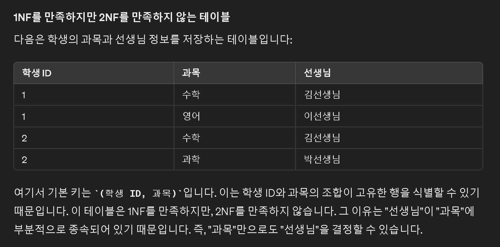
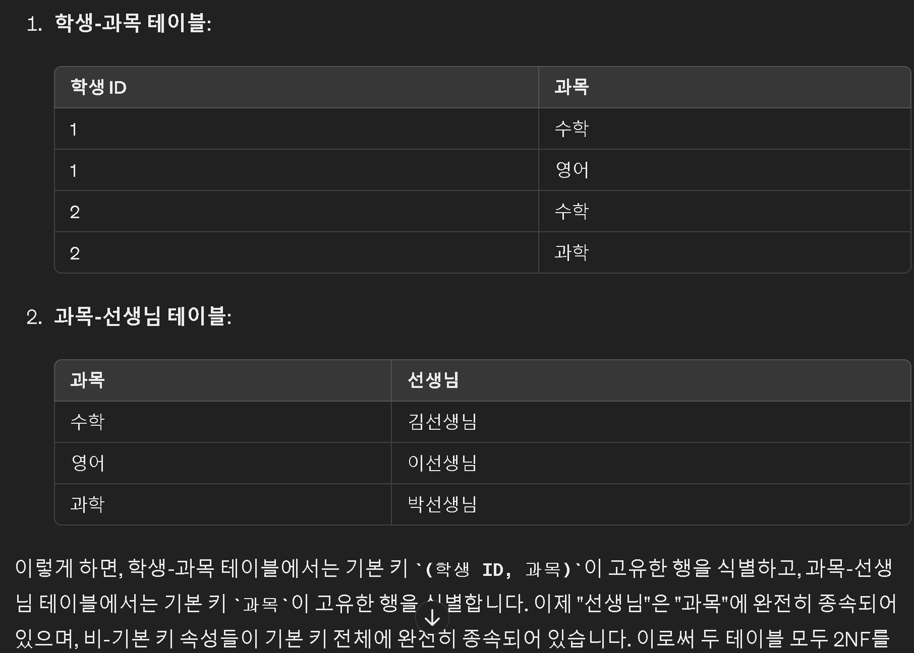

## 키의 종류
📝[출처](https://limkydev.tistory.com/108)
📌 **`키의 종류`는 `후보키`, `기본키`, `대체키`, `슈퍼키`, `외래키`가 있다.**

>후보키(Candidate Key)

릴레이션을 구성하는 속성들 중에서 튜플을 유일하게 식별할 수 있는 속성들의 부분집합을 의미한다.
모든 릴레이션은 반드시 하나 이상의 후보키를 가진다.
후보키는 모든 튜플에 대해 유일성과 최소성을 만족해야 한다.
`기본키가 될 수 있는 키를 후보키라고 한다.`

*튜플 : 릴레이션을 구성하는 각각의 행이다. 행=레코드=튜플
튜플의 수 = 카디널리티 = 기수 = 대응수

*`유일성` : 후보키는 모든 튜플(행)을 고유하게 식별할 수 있는 속성 집합임을 의미

*`최소성` : 후보키가 유일성을 유지하기 위한 최소한의 속성 집합임을 의미

>기본키(Primary Key)

후보키 중에서 선택한 Main Key이다.

`개체 무결성 제약 조건을 위배하지 않는 후보키`.

*`개체 무결성 제약 조건 : 1. 중복안됨 2. NULL값 안됨` 

>대체키

`기본키로 선택되지 못한 후보키`

>슈퍼키

`하나 이상의 속성들로 구성된 키`

>외래키

`다른 릴레이션의 기본키를 참조하는 키`

외래 키를 통해 두 테이블 간의 관계가 형성

NULL과 중복을 허용한다.
(개체 무결성 제약 조건 반대라고 보면 됨)

*참조 무결성 제약 조건 : 1. 부모 키가 존재해야함. 2. 부모 키와 자식 키가 타입 일치

참조 무결성 제약 조건과 개체 무결성 제약 조건은 Constraint로 설정하는 게 아니라, PK, FK이면 자동으로 설정

기본 PK와 FK만으로 일관성과 무결성을 보장할 수 있다.

*참조 무결성(Referential Integrity) 제약 조건 : 

>속성집합키

키는 속성집합이 될 수 있음. 
속성집합키를 Composite Key라고 한다.

## 정규화
📌 **`정규화` :: 관련된 개념 :: `DB의 중복` :: `Data의 무결성`**

🚀 `정규화`는 1NF부터 5NF까지 5단계로 나뉘어진다.

### 1. 1NF(First Normal Form)
`셀은 원자값만 가진다`

**비정규화 테이블:**
| OrderID | Items         |
|---------|---------------|
| 1       | A, B, C       |
| 2       | B, C         |

**1NF 테이블:**
| OrderID | Item |
|---------|------|
| 1       | A    |
| 1       | B    |
| 1       | C    |
| 2       | B    |
| 2       | C    |
### 2. 2NF(Second Normal Form)
`하나의 기본키만 가져라`

하지만 기본키가 속성집합키인 경우, 2NF를 만족할 수 있다.

***1. 비주요 속성들이 기본 키 전체에 대해 종속적이다.***

***2. 비 기본 키 속성들이 기본 키에 완전 함수 종속성을 갖는다.***

***3. 기본 키의 부분집합에 대해 종속적이어서는 안 된다.***

*비주요 속성 = 비 기본 키 속성

셋 다 같은 말이다..

부분 함수 종속성과 완전 함수 종속성의 차이를 이해해야 한다.

부분 함수 종속성이란 기본 키의 일부만으로도 특정 속성을 결정

모든 비-기본 키 속성이 기본 키에 완전히 종속되어야 한다.

완전 종속은 기본 키의 일부가 아닌 전체에 종속되는 것을 의미

 📝[같은 예시](https://limkydev.tistory.com/163)

---
공사중

📌 참고 (Note)
⚠️ 경고 (Warning)
ℹ️ 정보 (Info)
✅ 완료 (Completed)
🚀 시작 (Start)
🛑 중지 (Stop)
🔄 업데이트 (Update)
🔥 중요 (Important)
📝 작업 (Task)
🕒 시간 (Time)